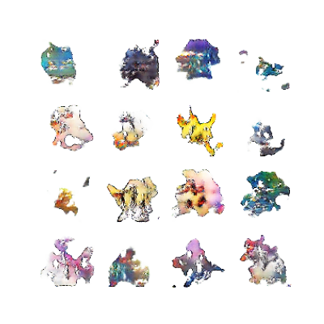

# **Pokemon GAN**

A DCGAN model was implemented here using Tensorflow 2.0. Pokemons are generated using a dataset of 7536 pokemons. Some sample pokemons generated:

<a href="url"></a>

### **Prerequisites**

1. Enter the dcgan directory

```
cd dcgan
```

2. Change the config.py file to fix your specific path files and configurations

### **Train**

1. Again, enter the dcgan directiory

2. Run

```
python main.py
```
